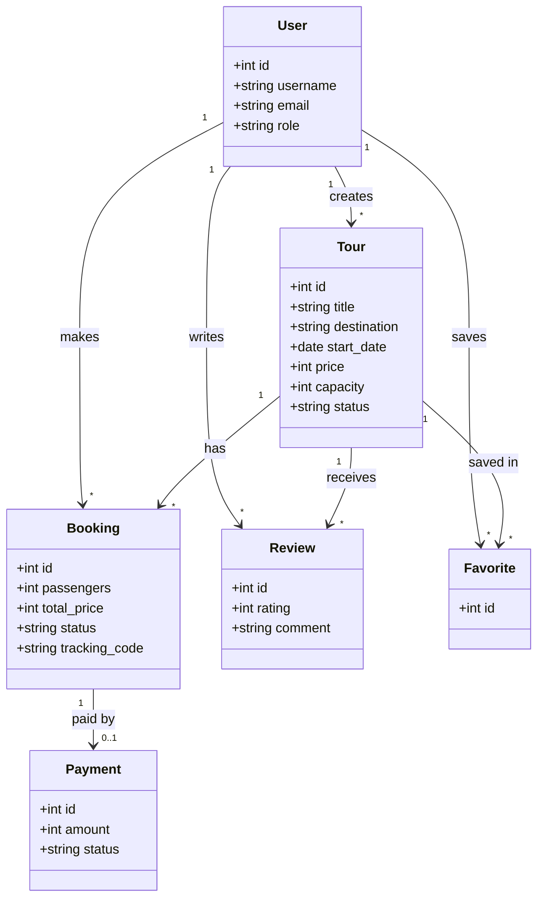

# دیاگرام کلاس — TourNest

```mermaid
classDiagram
    class User {
        +int id
        +string username
        +string email
        +string role
    }
    class Tour {
        +int id
        +string title
        +string destination
        +date start_date
        +int price
        +int capacity
        +string status
    }
    class Booking {
        +int id
        +int passengers
        +int total_price
        +string status
        +string tracking_code
    }
    class Payment {
        +int id
        +int amount
        +string status
    }
    class Review {
        +int id
        +int rating
        +string comment
    }
    class Favorite {
        +int id
    }

    User "1" --> "*" Tour : creates
    User "1" --> "*" Booking : makes
    Tour "1" --> "*" Booking : has
    Booking "1" --> "0..1" Payment : paid by
    User "1" --> "*" Review : writes
    Tour "1" --> "*" Review : receives
    User "1" --> "*" Favorite : saves
    Tour "1" --> "*" Favorite : saved in
```
