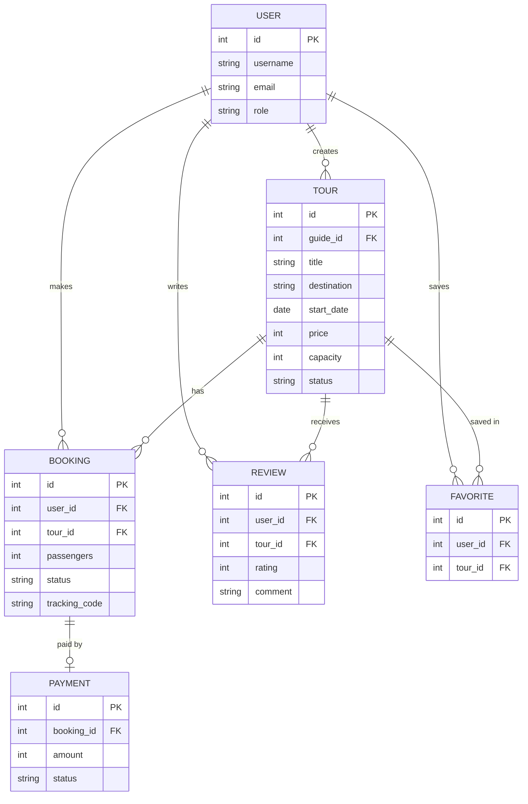

# طرح دیتابیس — TourNest

```mermaid
erDiagram
    USER ||--o{ TOUR : creates
    USER ||--o{ BOOKING : makes
    USER ||--o{ REVIEW : writes
    USER ||--o{ FAVORITE : saves
    TOUR ||--o{ BOOKING : has
    TOUR ||--o{ REVIEW : receives
    TOUR ||--o{ FAVORITE : "saved in"
    BOOKING ||--o| PAYMENT : "paid by"

    USER {
        int id PK
        string username
        string email
        string role
    }
    TOUR {
        int id PK
        int guide_id FK
        string title
        string destination
        date start_date
        int price
        int capacity
        string status
    }
    BOOKING {
        int id PK
        int user_id FK
        int tour_id FK
        int passengers
        string status
        string tracking_code
    }
    PAYMENT {
        int id PK
        int booking_id FK
        int amount
        string status
    }
    REVIEW {
        int id PK
        int user_id FK
        int tour_id FK
        int rating
        string comment
    }
    FAVORITE {
        int id PK
        int user_id FK
        int tour_id FK
    }
```
