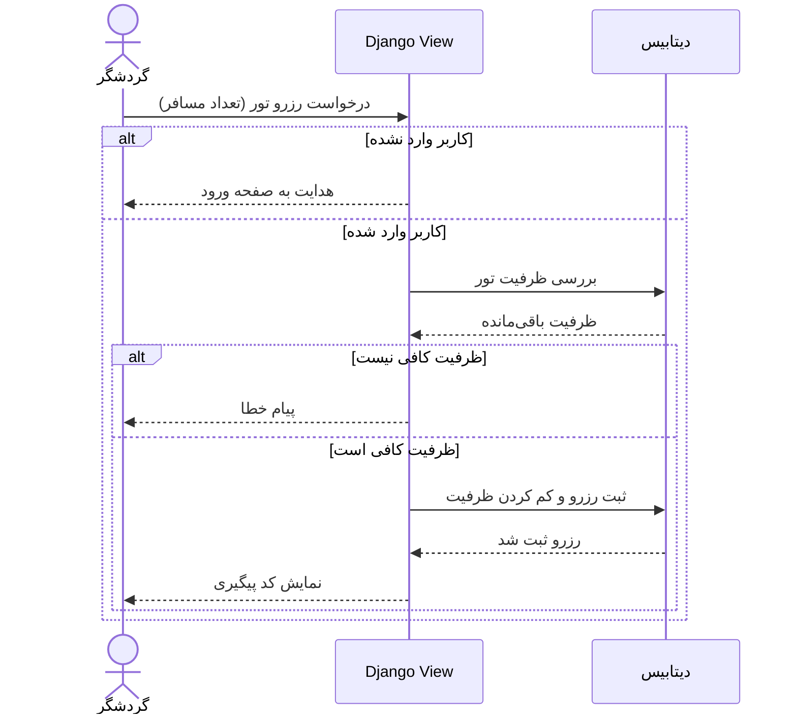

# دیاگرام توالی — رزرو تور

```mermaid
sequenceDiagram
    actor T as گردشگر
    participant V as Django View
    participant DB as دیتابیس

    T->>V: درخواست رزرو تور (تعداد مسافر)
    alt کاربر وارد نشده
        V-->>T: هدایت به صفحه ورود
    else کاربر وارد شده
        V->>DB: بررسی ظرفیت تور
        DB-->>V: ظرفیت باقی‌مانده
        alt ظرفیت کافی نیست
            V-->>T: پیام خطا
        else ظرفیت کافی است
            V->>DB: ثبت رزرو و کم کردن ظرفیت
            DB-->>V: رزرو ثبت شد
            V-->>T: نمایش کد پیگیری
        end
    end
```
